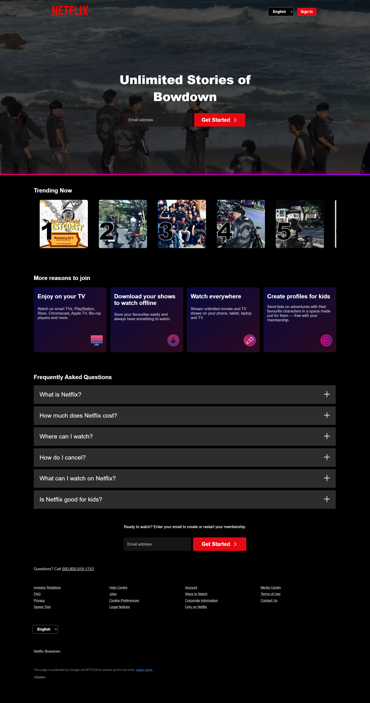

##  Profil
**Nama:** Mochammad Zidane Firdaus  
**Kelas:** IF D 2024  
**NPM:** 5520124118  

---

##  Deskripsi Proyek
Proyek ini merupakan hasil pembuatan ulang (clone) dari tampilan **halaman utama Netflix (Netflix Home)**.  
Tujuannya adalah untuk mempelajari dan memahami bagaimana struktur, tata letak, serta elemen-elemen antarmuka pengguna (UI) pada website profesional seperti Netflix dirancang.

---

##  Alasan Memilih Tampilan Netflix
Saya memilih untuk meniru tampilan **Netflix Home** karena:

1. **Desainnya sudah sangat dikenal dan menarik** — Netflix memiliki tampilan yang modern dan elegan, sehingga mudah dikenali oleh banyak orang.
2. **Fokus pada pengalaman pengguna (User Experience)** — tata letaknya bersih, navigasi sederhana, dan konten tersusun rapi sehingga memudahkan pengguna.
3. **Responsif di berbagai perangkat** — tampilan Netflix tetap terlihat bagus baik di komputer, tablet, maupun smartphone.
4. **Kombinasi warna yang kuat dan khas** — dominasi warna hitam dan merah menciptakan kesan premium dan tegas.
5. **Sebagai latihan pembelajaran front-end** — dengan meniru website besar seperti Netflix, saya dapat memahami lebih dalam penggunaan HTML dan CSS dalam pembuatan UI yang menarik dan profesional.

---

##  Teknologi yang Digunakan
- **HTML** – untuk struktur halaman  
- **CSS** – untuk styling dan tata letak responsif  
---

##  Fitur Utama
- Tampilan beranda mirip dengan halaman utama Netflix  
- Responsif untuk tampilan desktop dan mobile  
- Navigasi sederhana dengan menu utama dan banner film  
- Seksi film dengan layout bergulir (scroll horizontal)  
---

##  Preview


---

##  Cara Menjalankan
1. Clone repository ini  
   ```bash
   git clone https://github.com/zidanfrds/pwdnetflix.git
   ```

2. Buka folder proyek

   ```bash
   cd pwdnetflix
   ```
3. Jalankan di browser dengan membuka file `index.html`

---

##  Kesimpulan

Dengan membuat clone tampilan **Netflix Home**, saya belajar tentang:

* Penataan layout menggunakan **flexbox dan grid**
* Penggunaan **warna dan tipografi** untuk menciptakan identitas visual
* Membangun desain **responsif** agar tampilan tetap optimal di berbagai perangkat

---


